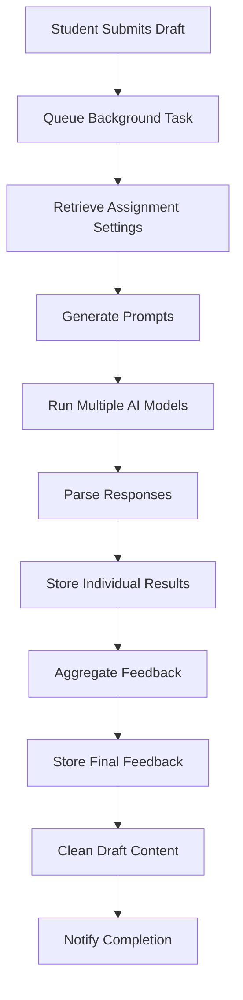

# FeedForward AI Integration Architecture

## Overview

FeedForward employs a sophisticated multi-model AI feedback generation system that supports multiple AI providers, concurrent model runs, and intelligent aggregation of feedback. The system is designed to provide high-quality, consistent educational feedback while maintaining flexibility and extensibility.

## Core Components

### 1. AI Model Management (`app/models/config.py`)

The system supports multiple AI providers through a unified interface:

```python
AIModel = ai_models.dataclass()
```

**Supported Providers:**
- OpenAI (GPT-4, GPT-3.5)
- Anthropic (Claude 3 Opus, Claude 3 Sonnet)
- Google (Gemini 1.5 Pro)
- Ollama (Local models)
- HuggingFace (Coming soon)

**Model Configuration:**
- `provider`: AI service provider name
- `model_id`: Specific model identifier
- `api_config`: JSON configuration including temperature, max_tokens, system prompts
- `owner_type`: 'system' or 'instructor' (for custom models)
- `capabilities`: JSON array of model capabilities ['text', 'vision', 'code', 'audio']
- `max_context`: Maximum context length supported

### 2. Feedback Generation Service (`app/services/feedback_generator.py`)

The core service orchestrating the feedback generation pipeline:

```python
class FeedbackGenerator:
    def __init__(self):
        self.max_retries = 3
        self.retry_delay = 2  # seconds
```

**Key Features:**
- Asynchronous processing using asyncio
- Automatic retry mechanism for API failures
- Support for multiple concurrent model runs
- Privacy-aware content handling

**Generation Pipeline:**
1. Draft submission received
2. Status updated to "processing"
3. Assignment settings retrieved
4. Multiple AI models run concurrently
5. Results aggregated using configured method
6. Feedback stored and made available
7. Draft content cleaned for privacy (if configured)

### 3. Prompt Engineering (`app/services/prompt_templates.py`)

A sophisticated prompt template system that generates context-aware prompts:

```python
class PromptTemplate:
    def generate_prompt(self, context: PromptContext) -> str
```

**Prompt Components:**
1. **System Prompt**: Establishes the AI's role as an educational assessment assistant
2. **Assignment Context**: Title, description, draft version, word count
3. **Rubric Criteria**: Weighted evaluation criteria with descriptions
4. **Student Submission**: The actual student work
5. **Feedback Instructions**: Level-specific guidance (overall/criterion/both)
6. **JSON Format Requirements**: Structured output specifications

**Specialized Templates:**
- `PromptTemplate`: Standard feedback generation
- `IterativePromptTemplate`: Draft-aware feedback that acknowledges improvements

### 4. Model Orchestration

The system uses LiteLLM as a unified interface for all AI providers:

```python
async def _call_ai_model(self, model: AIModel, prompt: str, api_config: Dict) -> str:
    # Prepare model string for LiteLLM
    if model.provider.lower() == "openai":
        model_string = model.model_id
    elif model.provider.lower() == "anthropic":
        model_string = f"claude-{model.model_id}"
    elif model.provider.lower() == "ollama":
        model_string = f"ollama/{model.model_id}"
```

**Features:**
- Automatic API key management
- Provider-specific formatting
- Response format enforcement (JSON for supported models)
- Error handling and retries

### 5. Feedback Aggregation

Multiple aggregation methods are supported to combine feedback from multiple model runs:

```python
# Aggregation methods initialized in app/init_db.py
aggregation_methods = [
    (1, "Mean", "Simple average of all scores"),
    (2, "Weighted Mean", "Weighted average based on confidence scores"),
    (3, "Median", "Middle value of all scores"),
    (4, "Trimmed Mean", "Average after removing highest and lowest scores")
]
```

**Aggregation Process:**
1. Collect scores from all successful model runs
2. Apply selected aggregation method:
   - **Average**: Simple mean of all scores
   - **Weighted Average**: Confidence-weighted mean
   - **Maximum**: Highest score (optimistic)
   - **Median**: Middle value (robust to outliers)
3. Deduplicate and combine feedback text
4. Sort feedback by frequency (most common first)
5. Store aggregated results

### 6. Data Models and Storage

**Core Tables:**
- `drafts`: Student submissions with privacy controls
- `model_runs`: Individual AI model execution records
- `category_scores`: Rubric-based scoring per category
- `feedback_items`: Granular feedback (strengths/improvements)
- `aggregated_feedback`: Final combined feedback

**Privacy Features:**
- Automatic content removal after feedback generation
- Optional content preservation flag
- Tracking of content removal dates
- Student-controlled visibility (soft delete)

### 7. Assignment Configuration

Each assignment can be configured with:
- **Primary AI Model**: Used for final aggregation
- **Feedback Level**: 'overall', 'criterion', or 'both'
- **Number of Runs**: How many times to run each model
- **Aggregation Method**: How to combine multiple runs
- **Feedback Style**: Tone and approach preferences
- **Review Requirements**: Instructor approval before release

### 8. Background Processing

Asynchronous task handling for non-blocking feedback generation:

```python
async def queue_feedback_generation(draft_id: int) -> bool:
    # Check if task is already running
    # Create and track the task
    # Process in background
```

**Features:**
- Concurrent task processing
- Task status tracking
- Automatic cleanup of completed tasks
- Prevention of duplicate processing

## Feedback Generation Flow



## Prompt Engineering Details

### System Prompt Structure
The system prompt establishes the AI's role and guidelines:
- Expert educational assessment assistant
- Focus on constructive, actionable feedback
- Balance strengths with improvements
- Maintain encouraging tone
- Use specific examples from student work

### Context-Aware Prompting
For iterative assignments, the system:
- Acknowledges the draft number
- Recognizes improvements from previous drafts
- Provides progression-focused feedback
- Maintains consistency across drafts

### JSON Output Format
Structured feedback ensures consistent parsing:

```json
{
  "criteria_feedback": [
    {
      "criterion_name": "Thesis Development",
      "strengths": ["Clear main argument", "Well-supported claims"],
      "improvements": ["Consider counterarguments"],
      "examples": ["In paragraph 3, you effectively..."],
      "score": 85
    }
  ],
  "overall_feedback": {
    "strengths": ["Strong analytical thinking"],
    "improvements": ["Expand conclusion"],
    "suggestions": ["For your next draft, focus on..."],
    "score": 82,
    "summary": "Overall assessment..."
  }
}
```

## Error Handling and Resilience

1. **API Failures**: Automatic retry with exponential backoff
2. **Parsing Errors**: Fallback to simple structure extraction
3. **Model Timeouts**: Configurable timeout limits
4. **Invalid Responses**: Default scoring and generic feedback
5. **Task Failures**: Status tracking and error logging

## Security and Privacy

1. **API Key Management**: Encrypted storage, per-instructor keys
2. **Content Privacy**: Automatic removal after processing
3. **Access Control**: Role-based permissions
4. **Data Retention**: Configurable retention policies
5. **Audit Logging**: Comprehensive activity tracking

## Performance Optimizations

1. **Concurrent Processing**: Multiple models run in parallel
2. **Async Operations**: Non-blocking I/O throughout
3. **Response Caching**: 15-minute cache for repeated requests
4. **Batch Operations**: Efficient database updates
5. **Resource Limits**: Configurable worker pools

## Extensibility

The architecture supports easy addition of:
- New AI providers (via LiteLLM)
- Custom aggregation methods
- Additional feedback styles
- New prompt templates
- Custom model configurations
- Provider-specific features

## Configuration Best Practices

1. **Model Selection**: Choose models based on task complexity
2. **Temperature Settings**: Lower for consistency, higher for creativity
3. **Token Limits**: Balance quality with cost
4. **Aggregation Methods**: Match to assessment goals
5. **Feedback Styles**: Align with pedagogical approach

## Future Enhancements

1. **Multi-modal Support**: Image and code analysis
2. **Adaptive Prompting**: Learn from instructor edits
3. **Cost Optimization**: Smart model selection
4. **Real-time Feedback**: Streaming responses
5. **Collaborative Features**: Peer review integration