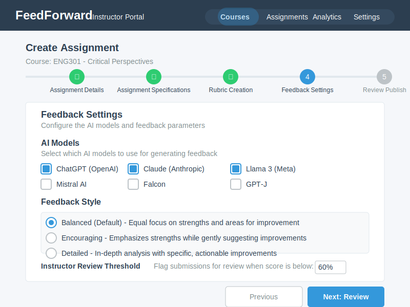

# User Interface Mockups
{: .no_toc }

## Table of contents
{: .no_toc .text-delta }

1. TOC
{:toc}

---

## Overview

These mockups illustrate the user interface design for FeedForward's key features and workflows. They demonstrate the visual design principles and interaction patterns that guide the platform's development.

## Student Interface Mockups

### Student Dashboard

The main student interface for viewing courses and submissions:

**Key Features:**
- Clean, focused interface
- Clear navigation between courses
- Quick access to recent feedback
- Progress indicators for assignments

### My Submissions View

Students can track all their submissions in one place:

**Key Features:**
- Comprehensive submission history
- Status indicators for each draft
- Quick access to feedback
- Progress tracking across drafts

### Feedback History

Detailed view of feedback received over time:

**Key Features:**
- Chronological feedback display
- Score progression visualization
- Category-based breakdown
- Improvement tracking

## Instructor Interface Mockups

### Course Creation

Simple dialog for creating new courses:

**Key Features:**
- Minimal required fields
- Clear form layout
- Helpful descriptions
- Quick creation process

### Assignment Creation Workflow

Multi-step process for creating assignments:

**Key Features:**
- Step-by-step guidance
- Progressive disclosure
- Clear navigation
- Save draft capability

### Assignment Specifications

Detailed assignment configuration:

**Key Features:**
- Comprehensive settings
- Organized sections
- Clear labels
- Helpful tooltips

### Rubric Creation

Interface for building evaluation rubrics:

**Key Features:**
- Visual rubric builder
- Weight distribution
- Criteria descriptions
- Template library

### Feedback Settings

Configuration for AI feedback generation:

**Key Features:**
- Model selection
- Parameter tuning
- Style preferences
- Cost estimation

### Student Management

#### Import Students Dialog

Bulk student invitation interface:

**Key Features:**
- CSV upload support
- Preview before sending
- Error handling
- Progress tracking

#### Course Students Tab

Student roster management:

**Key Features:**
- Student list with status
- Bulk actions
- Search and filter
- Individual student details

### Feedback Review

Interface for reviewing and approving AI-generated feedback:

**Key Features:**
- Side-by-side comparison
- Edit capability
- Approval workflow
- Batch operations

### Analytics Views

#### Course Feedback Statistics

Course-level analytics dashboard:

**Key Features:**
- Visual data representation
- Key metrics highlighted
- Trend analysis
- Exportable data

#### Global Analytics

Institution-wide analytics view:

**Key Features:**
- High-level overview
- Comparative analysis
- Performance indicators
- Drill-down capability

## Workflow Diagrams

### Educational Workflow

The core educational workflow that guides the platform design:

**Key Components:**
- Instructor creates structured assignments
- Students submit iterative drafts
- AI generates rubric-aligned feedback
- Instructors review and approve
- Students improve through revision

## Design Patterns

### Common UI Elements

Consistent patterns used throughout the interface:

1. **Cards** - Used for grouping related information
2. **Status Badges** - Visual indicators for states
3. **Progress Bars** - Show completion and improvement
4. **Action Buttons** - Clear primary and secondary actions
5. **Data Tables** - Sortable, filterable lists
6. **Modals** - Focused task completion
7. **Tabs** - Organize related content
8. **Breadcrumbs** - Navigation context

### Responsive Design

All mockups follow responsive design principles:

- **Desktop First** - Full functionality
- **Tablet Adaptive** - Touch-optimized
- **Mobile Capable** - Core features accessible
- **Print Ready** - Clean output for reports

### Accessibility Features

Design considers accessibility throughout:

- **High Contrast** - Clear visual hierarchy
- **Focus Indicators** - Keyboard navigation
- **Alt Text** - Screen reader support
- **ARIA Labels** - Semantic markup
- **Color Independence** - Not reliant on color alone

## Implementation Notes

### Technology Alignment

These mockups align with the technical architecture:

- **FastHTML Components** - Server-side rendering
- **HTMX Integration** - Dynamic updates
- **Tailwind CSS** - Utility-first styling
- **Progressive Enhancement** - Works without JavaScript

### Iterative Design

These mockups represent iterative refinement based on:

- User feedback
- Usability testing
- Technical constraints
- Educational best practices

### Future Iterations

Areas identified for future design exploration:

1. **Mobile-First Views** - Dedicated mobile interfaces
2. **Dark Mode** - Alternative color scheme
3. **Customization** - User-configurable layouts
4. **Advanced Analytics** - More visualization options
5. **Collaboration Features** - Peer review interfaces

## Using These Mockups

### For Developers

- Reference for implementation
- Component specifications
- Interaction patterns
- State representations

### For Stakeholders

- Vision communication
- Feature understanding
- Workflow visualization
- Progress tracking

### For Users

- Training materials
- Documentation visuals
- Feature previews
- Expectation setting

---

{: .note }
> These mockups are living documents that evolve with the platform. They represent the current vision while remaining flexible for future improvements.